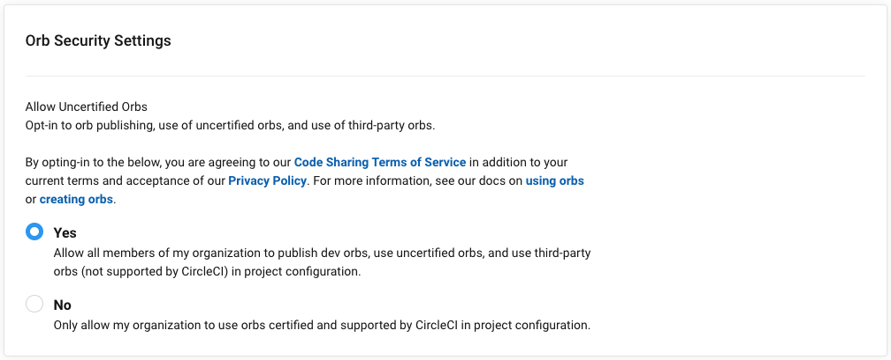
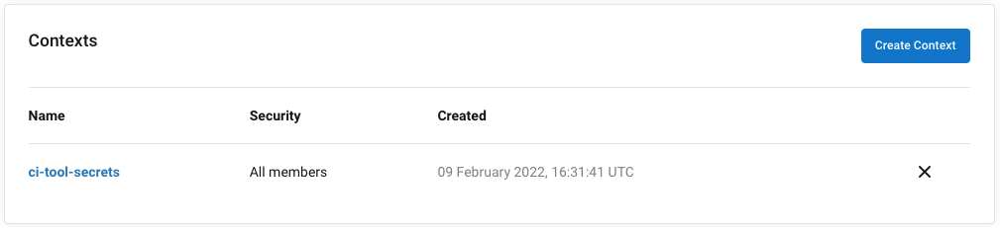

[Nx](https://nx.dev) is great for monorepos. The tooling is smart, fast, and easy.

Too easy.

In fact, it is so easy to start a workspace and effortlessly begin scaffolding code libraries and compose them into fully tested applications that you might quickly find yourself in a "now what?" situation when it comes time to build and deploy through a proper CI/CD pipeline.

This is when the naysayers will strike.

If you work on a development team, regardless the size, there will be at least one team member not bought into the monorepo concept. They lurk in the shadows waiting to pounce at the first sign of trouble with "Plan B" fully locked and loaded. As such, planning ahead to avoid as many "now what?" situations as possible. The more work you do up front, like configuring CI/CD, the more likely your team will ship their first feature from the workspace without issue.

### The Devil is in the Details

I have been in these "now what?" situation before; most recently when I underestimated the nuances of configuring CircleCI in an Nx workspace. After all, the Nx documentation already contains [Configuring CI Using CircleCI and Nx](https://nx.dev/ci/monorepo-ci-circle-ci) and the Nx Cloud documentation contains a [CircleCI section](https://nx.app/docs/configuring-ci#circle-ci).

### Configure the Nx Workspace

Every CircleCI project requires a `.circleci/config.yml` file at the root of the repository.

```{diff}
// nx workspace

+ .circleci/
+    config.yml
apps/
libs/
...
nx.json
...
workspace.json
```

Now add this initial pipeline inspired by the Nx documentation.

```yml
# .circleci/config.yml

version: 2.1

orbs:
  node: circleci/node@5.0.0
  nx: nrwl/nx@1.1.3

commands:
  nx--run-checks:
    steps:
      - run:
          name: Run nx affected:build
          command: npx nx affected --base=$NX_BASE --head=$NX_HEAD --target=build --parallel=3
      - run:
          name: Run nx affected:lint
          command: npx nx affected --base=$NX_BASE --head=$NX_HEAD --target=lint --parallel=3
      - run:
          name: Run nx affected:test
          command: npx nx affected --base=$NX_BASE --head=$NX_HEAD --target=test --parallel=3

jobs:
  main:
    executor:
      name: node/default
      tag: 16.14-browsers
    steps:
      - checkout
      - node/install-packages:
          pkg-manager: yarn
      - nx/set-shas
      - nx--run-checks
  pr:
    executor:
      name: node/default
      tag: 16.14-browsers
    steps:
      - checkout
      - node/install-packages:
          pkg-manager: yarn
      - nx/set-shas
      - nx--run-checks

workflows:
  build:
    jobs:
      - main:
          filters:
            branches:
              only: main
      - pr:
          filters:
            branches:
              ignore: main
```

If this pipeline seems overly simplistic, it is. At this point we only want to validate that the `nrwl/nx` orb is configured properly and that the Nx `affected` commands execute as expected. Application specific configurations will come later.

Finally, any changes to `.circleci/configy.yml` should affect every project. This can be configured in `nx.json` using `implicitDependencies` as shown below.

```json{diff}
// nx.json

"implicitDependencies": {
+  ".circleci/*.yml": "*",
  "package.json": {
    "dependencies": "*",
    "devDependencies": "*"
  },
  ".eslintrc.json": "*"
},
```

This ensures that as changes are made to the pipeline, the Nx `affected` commands will execute against their targets as expected.

### Setup the CircleCI Project

This section assumes that you have already [created a CircleCI account](https://circleci.com/docs/2.0/first-steps/) and connected your GitHub account. Once you are logged in and your source code connect, the `Projects` dashboard

#### Enable Dynamic Configuration

#### Organization Settings

There are two Organization Settings required for the initial pipeline to run:

**Orb Security Settings**

1. Navigate to `Organization Settings`
2. Click the `Security` tab in the left menu
3. In the `Orb Security Settings` check `Yes` to `Allow Uncertified Orbs` 

**Create a Context**

A CircleCI context defines environment variables that can be referenced by jobs in a pipeline. The `nrwl/nx` orb requires a `CIRCLE_API_TOKEN` that contains a user token. Once you have [created the token](https://circleci.com/docs/2.0/managing-api-tokens/#creating-a-project-api-token), continue with the steps below.

1. Navigate to `Organization Settings` in CircleCI
2. Click the `Contexts` tab on the left
3. Click the `Create Context` button
4. In the dialog, enter the name `ci-tool-secrets` and click `Create Context`

The new context is now listed in the `Contexts` list as shown below.



5. Click the new `ci-tool-secrets` item in the contexts list
6. Click `Add Environment Variable`
7. In the dialog, enter `CIRCLE_API_TOKEN` for the **Environment Variable Name** and paste your user token into the **Value** text box; click `Add Environment Variable`

### Define the Continuation Pipeline

### Generate the Continuation Pipeline Parameters

### Enable the Setup Workflow
