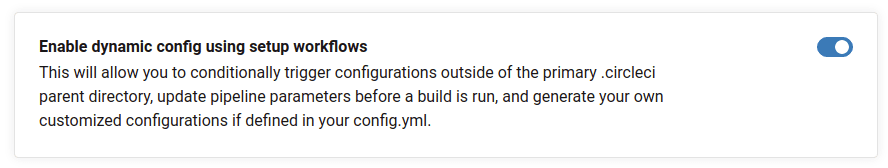

I recently had the opportunity to introduce a development team to [Nx][nx] and the benefits of working in a monorepo. The first question I was asked after my introductory presentation: "How do we build and deploy from the Nx workspace using CircleCI?"

Having no prior experience with CircleCI, I attempted to port an Azure DevOps pipeline I knew worked to a `.circleci/config.yml` file...

Fail.

It turned out I had a lot to learn about CircleCI and I want to share that knowledge by walking through how I build and deploy [my blog](https://kenniejaydavis.com) from an [Nx workspace][sellmeadog] to Netlify using [CircleCI dynamic configuration][circle_dc]. I will do my best to cover everything in as much detail as possible and all of the code and configuration covered is [available here][sellmeadog] for reference.

## Getting Started

This is not meant to be an introduction to CircleCI or Nx and as such the basics of each will not be covered. Additionally, please consider the following:

- Dynamic configuration is only supported in CircleCI Cloud or Server 3.x
- The guide makes extensive use of [orbs][orbs]; be sure you can access and download from the registry
- The [CircleCI CLI][circle_cli] is an invaluable testing tool as it enables you to validate your config file and even execute jobs locally (with some exceptions)

## What is Dynamic Configuration?

To summarize the [documentation][circle_dc], dynamic configuration is the ability to generate CircleCI configuration for affected projects in the Nx workspace to ensure that the entire workspace does not needlessly go through a full build, test and deployment process. Your pipeline execution is essentially split into two distinct phases, **_setup_** and **_continuation_**, with each typically having a corresponding config file, `config.yml` and `continue.config.yml` respectively.

Before you can use dynamic configuration, you need to [enable it in your CircleCI project](https://circleci.com/docs/2.0/dynamic-config/#getting-started-with-dynamic-config-in-circleci).

From the **Projects** dashboard:

- Open the **Project Settings** for your Nx workspace
- Click on the **Advanced Tab**
- Find and enable **Enable dynamic config using setup workflows** at the bottom the page



### Setup Workflow

The setup workflow is responsible for determining what will be dynamically triggered in the continuation phase. I explored two strategies that I will cover:

1. Computing pipeline parameters that are passed to a static `continue.config.yml` with conditional workflows per project in the workspace
2. Merge project specific CircleCI configuration into a dynamically generated `continue.config.yml` that explicitly defines the workflows to execute

```yaml {diff}
version: 2.1

- setup: false
+ setup: true

orbs:
  node: circleci/node@5.0.0
  nx: nrwl/nx@1.1.3
```

[circle_cli]: https://circleci.com/docs/2.0/local-cli/
[circle_dc]: https://circleci.com/docs/2.0/dynamic-config/
[nx]: https://nx.dev
[orbs]: https://circleci.com/docs/2.0/orb-intro/
[sellmeadog]: https://github.com/sellmeadog/sellmeadog
